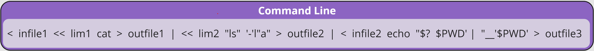
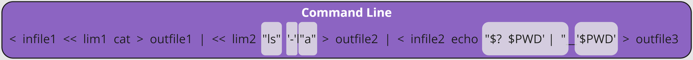
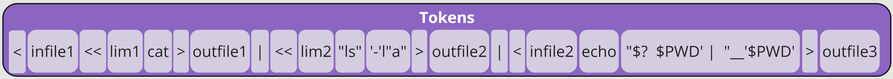
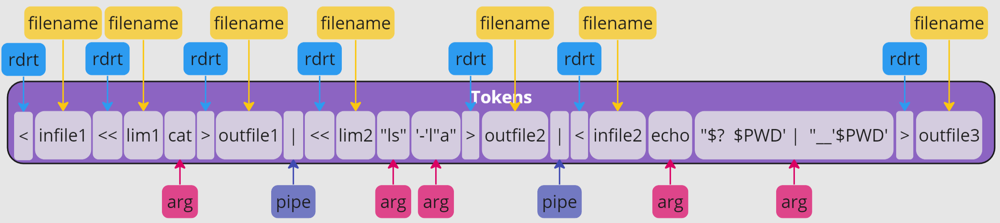
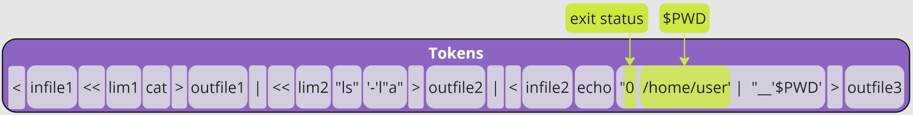
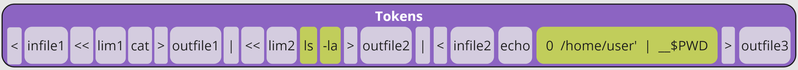
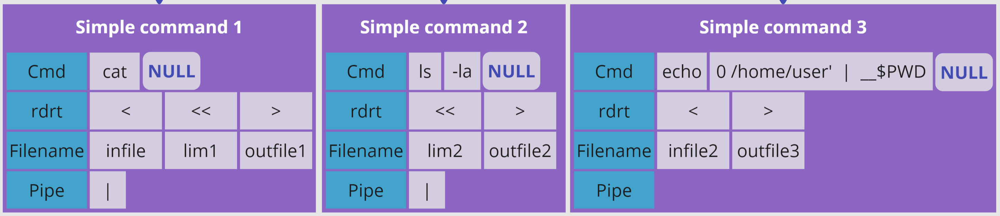
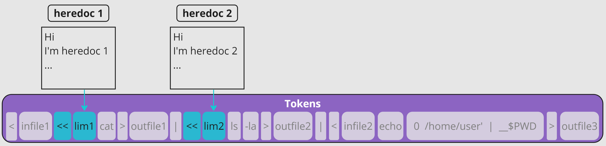
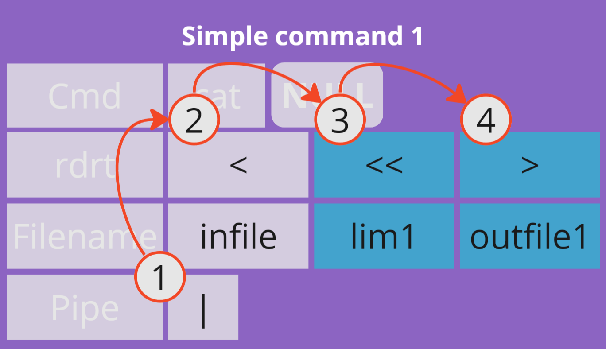
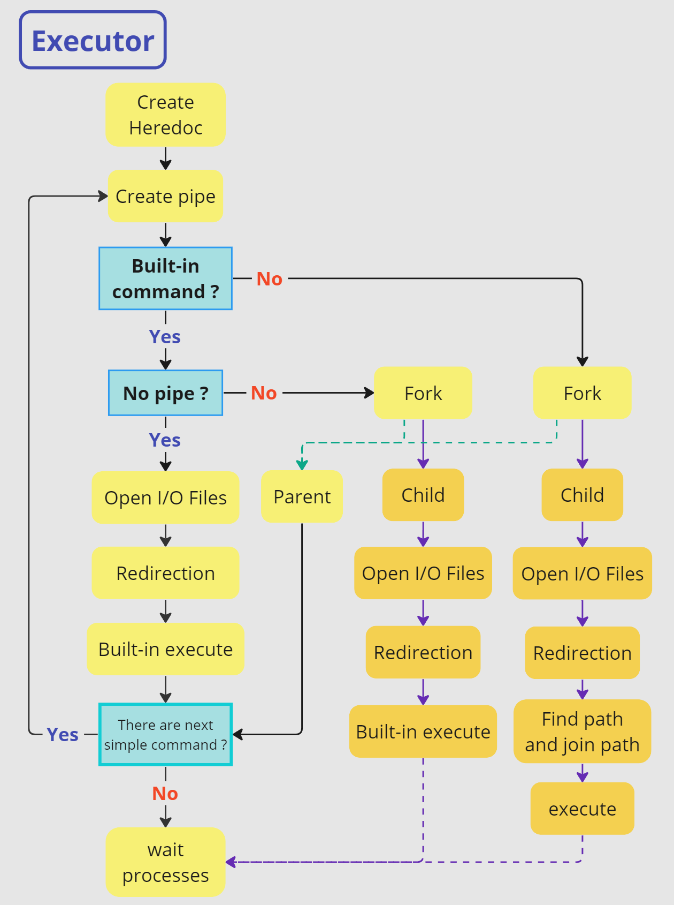

<h1 align="center">Mimishell</h1>

> The Project is Create a basic shell, similar to bash. The goal is to replicate some of the core functionalities of a Unix shell, such as executing commands, handling pipes, redirections, and signals

## How the program work?
The program can seperate into 4 Part 1. Lexer, 2.Parser, 3.Execution and 4.Built-in. The program start by using library function `readline` to take input from terminal. I will illustrate step by step via the following command line.

- Loop function `readline` and store command line in string. And interpret command as the part of **Lexer**, **Parser** and **Executor** in order.
- Use function `add_history` to store history command line.
### Part 1 : Lexer
1. **Valid Quote** : Command line must don't have unclosed quoted.
- `'` `"` Check are there unclosed quotes.

2. **Tokenization** : will seperate the command line into tokens by.
- White space: `' '` 
- Redirection : `<` , `>` , `<<` , `>>`
- Pipe : `|`

3. **Classify Token** : will classify the type of tokens
- Redirection : `<` , `>` , `<<` , `>>`
- Filename : String that follow after Redirection.
- Command or Argument : Other string.
- Pipe

4. **Valid Syntax** :
    - Never have `|` or `||` near tokens.  
    - Never have `<`,`<<`,`>`,`>>` by didn't follow filename.  

### Part 2 : Parser
1. **Variable Expansion** : `$` will searching the variable in environment and get the value from it.

2. **Trim Quote** : Outer quote will be trim. Both of `'`(Single quote) and `"`(Double quote).

3. **Parsing** : will arrange the token into simple command struct.
- Simple command be seperate by `|` (pipe).

### Part 3 : Execution
1. If there are here_doc(`<<`) in command line, Create all here_doc first.

2. **Pipe Creation** : if there is pipe, Create pipe.
3. **Open Files** : open files on each simple command from left to right. 
    1.Pipe that we are created. 
    2.open **infile**. 
    3.close **infile** and open **heredoc file (lim1)**. 
    4.open **outfile1**. 
    

4. **Redirections** : The Shell will redirect the last input/output by using function `dup2`.

5. **Executor** : There are 2 alternative possible execution.
    1. Built-in command : if command are listed on Built-in.
        - if **No pipe** Shell will open files, redirection and execute in parent process.
        - else Shell will fork child to open files, redirection and execute.
    2. Non Built-in command : The Shell will create child process by forking open files, redirection and execute the command.
6. **Exit Status** : Wait process to record exit status.
7. **Cleanup** :
- Closing all file descriptors
- Free all memory

<h3 align="center">Diagram of execution</h3>

### Part 4 : Built-in
#### 1. `echo`
- **No argument** : Print newline.
- **With** **Argument** : Display a line of text with newline.
- **With flag `-n` .** : Display a line of text with no newline.
#### 2. `cd`
- When start the minishell program.
    - Shell will inherit `pwd` form Parent process, So you will be at the same working directory at previous terminal.
    - `PWD` will be update and `OLDPWD` will be set to NULL in **environment**.
- If change directory success : Update `OLDPWD` and `PWD` in **environment**.
- **No argument** : Change working directory to value of the **`HOME`** **environment variable**. ( if you change value of the **`HOME`** **environment variable** this will change too.)
- **1 argument** : Change working directory to the argument path.
- **Many arguments** : Don’t change working directory and display Error “Too many arguments”
- **There aren’t directory path exist.** : Display “No such file or directory”
- **If it not directory path** : Display “Not a directory”
#### 3. `pwd` : Print working directory.
- Changing the value of the PWD environment variable will not change the working directory of the shell process or affect the behavior of the pwd command.
#### 4. `export` : the `export` command is used to create or modify environment variables
- if no argument : Display **environment** by sorting alphabetical (as ascii).
- `export` command can take more than one argument.
        - if variable was exist, Change the value of the variable.
        - if variable not exist, Create new one.
- **If Invalid variable.** : Display “not a valid identifier”
#### 5. `unset` : Remove a variable from enviroment.
- if no argument, Nothing happen.
- `Unset` command can take more than one argument.
- **If Invalid variable.** : Display “not a valid identifier”
#### 6. `env` : Display environment.
#### 7. `exit`
- if no argument, Exit from **Minishell**.
- if there are argument, Exit with status code from the argument.
    - if status code more than 255 or negative, it will overflow.

> [!WARNING]
> ! if there are pipe in command line, Shell will fork a Child to execute the command. So `cd` , `unset` , `export` and `exit` command That effect on Parent processes will run on Child processes and Nothing gonna happen.
#### Signal (additional)
1. Handle interrupt signal `Ctrl+C`. 
2. Handle quit signal `Ctrl+\`. 
